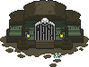
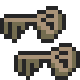
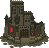
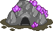
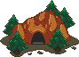
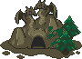
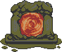
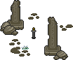
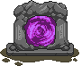
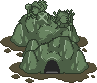

<div class="title">Dungeons </div>

Dungeons are an activity in which a player explores a monster filled dungeon.
One needs to be Tier 3 in order to access them.
Dungeons have a certain number of floors which depends on the Tier of the player opening it.
Further floors may only be accessed once the previous floor has been completed.
At the end of a dungeon, players obtain additional rewards such as materials or other items (oftentimes referred to as EoD/EoG rewards, for End-of-Dungeon/Gauntlet rewards).

There exists 2 kinds of dungeons: Battle Dungeons and Exploration Dungeons.

# Battle Dungeons
Battle Dungeons are the original dungeons that were introduced into the game.
They feature a fight per floor, which the player must win in order to access the next one.
Once the fight has ended, the next one can be immediately started, making Battle Dungeons an efficient way of fighting numerous enemies.

Once the dungeon has started, players have no opportunity to rest.
Dungeons can be fled from to change gear/class/pet and re-entered with a new loadout.
In this case, Ward/HP/MP may be clamped if the _max_ Ward/HP/MP of the new loadout is lower than the _current_ Ward/HP/MP when the dungeon was last fled from.
Also, the enemies on the floor that was currently being fought will be fully healed.

Although one cannot heal between battles (only through healing spells and items if not in [Hard mode](#hard-option)), status effects do remain from one floor to the next one.
There are some exceptions to that such as Doom, which will dissipate when completing a floor.
A common strategy which makes heavy use of that is to use the first floor(s) to apply as many buffs as possible, which can be kept until the end of the dungeon, in order to one shot as many floors as possible.

The Battle Dungeon ends when the player has successfully defeated all floors or when the player is defeated.
If the player is defeated, no End-of-Dungeon rewards are awarded.

Bosses defeated in a Battle Dungeon only reward 1/4 of their base Gold, Orn and Exp rewards.
There is no known reduction for item drops.

```admonish todo "TODO(ethiraric, 23/06/2024)"
Horde dungeons debuff? Needs testing in both Themed and regular dungeons.
```

# Exploration Dungeons
## Overview
Exploration Dungeons were released with [3.9.3](https://playorna.com/releases/107/) on November 29th 2023.
They are made available through [Mystic Caves](#mystic-caves) and [Goblin Fortresses](#goblin-fortresses), which are since no longer available as Battle Dungeons.

With Exploration Dungeons, players enter a top-down 2D view of the floor where they can freely move from room to room.
Rooms may contain different entities such as monsters, bosses, mineable resource nodes, (Kingdom) Orns / Gold, Kingdom Florens and Materials.

Contrary to Battle Dungeons, the objective for each floor is not always to defeat enemies.
It is one of:
  * Defeat X monster(s)
  * Defeat X boss(es)
  * Find the exit (hidden behind a mineable decoration)
  * Reveal and activate the 4 floor switches (hidden behind mineable decorations) then proceed to the exit

Exploration Dungeons have much fewer floors than Battle Dungeons, but each takes much longer to be completed.

Exploration Dungeons also reward better [End-of-Dungeon rewards](#end-of-dungeon-rewards) and have no fight rewards reduction for bosses as Battle Dungeons do.

### Mining
Mining is the activity exclusive to Exploration Dungeons.
This can either be done by manually tapping the resource nodes or the pickaxe to the bottom-left of the UI.
If the pickaxe is held down, the character will walk from one resource node to the other and automatically mine them.
If the pickaxe is repeteadly tapped, the mine animation will be interrupted but still completed, meaning it is very slightly faster than holding down.
Once there is no longer any resource node in the room, the pickaxe will be greyed out.

If using the pickaxe, it may happen that the character stucks itself looping over 2 tiles.
If that happens, the pickaxe must be released until the character stops on a tile and then re-tapped.
Also, there may be resource nodes in out-of-reach places for the character.
While they are in the room, the pickaxe will not go grey, but the character will not move when tapping it.
The resource nodes must be mined by tapping on them directly.

When mining, the character gathers remnants of resource nodes, which can later be exchanged for Deep Shards.
The process is explained [here](#mining-for-deep-shards).
Mining is also sometimes required to progress further into the dungeon, to uncover the exit or the floor switches.

### Fighting
Monsters and bosses roam the floors of the dungeons. 
They may appear in any room which is not in the bottom-most row.
They can be fought by tapping them (short or long, as on the overworld).
This starts the battle as it would in the overworld.

Unlike with Battle Dungeons, no status effect carries from one fight to the other.
The character also starts each fight with full health and mana.
Being defeated in an Exploration Dungeon does not end the run as it would with Battle Dungeons.
Instead, the fight is stopped and the game returns to the floor view, where the player can re-try the fight as many times as they want (starting with full HP/MP), until the Dungeon timer expires.

The last floor of a dungeon always has 2 rooms only: the starting room and a single boss in the room immediately up, which must be defeated to complete the Dungeon.
When defeating it, the rewards screen will show up both the fight reward and Dungeon completion rewards.

### Gathering pickups
Any room in any floor has a chance of containing one or more pickups.
They can be collected by tapping once on them.

These pickups may contain:
  - Kingdom Gold
  - Kingdom Orns
  - Kingdom Florens (~80-120)
  - Gold
  - Orns
  - A random material (10-20)

Prior to tapping on them, there is no way of knowing if a gold/orn pickup is personal Gold/Orns or Kingdom Gold/Orns.

```admonish todo "TODO(ethiraric, 23/06/2024)"
Add numbers
```

## UI
<center>

</center>

1. Quick-access buttons (Codex, Quests, Map, Items).
   The Map button displays a layout of the floor as seen in [Floor Layout](#floor-layout).
2. The resources collected.
   Here, they are from top to bottom the 10:1, 5:1 and 2:1 resources respectively.
   The green bar shows the progress to the next Deep Shard (80%, 20%, 50% respectively).
3. The floor quest.
   Completing it will reveal the portal to the next floor.
4. Active buffs.
5. The portal to the next floor.
   On floors with the 4 switches quest, there is no portal but a dedicated room with the path to the next floor.
6. A monster (Lost Memory).
7. A resource node.
8. A mined resource node.
9. A boss (Enlightened Prince).
   Like on the overworld, bosses appear larger than monsters.
10. An Orns or Kingdom Orns pickup.
11. The Deep Kiln in the starting room, to smelt resources into Deep Shards.
12. Path to the previous floor in the starting room.
13. The directional pad to move from room to room and the pickaxe to direct the character to move and mine a resource node.
    Direction to which the player can go have white arrows, while those to which they cannot have greyed arrows.

```admonish todo "TODO(ethiraric, 25/06/2024)"
Are resources always in that order?
```

## Floor layout
The layout of a floor can be seen as a grid of size at least 1x3 and at most 4x5.
Not all cells have to have a room.

Players start in one room on the bottom row of the floor.
Rooms on the bottom row often but not always branch up.
They may also branch sideways.

Once we go up from a room in the bottom row (if there is a path), there will be other rooms until we reach the top-most row of the floor.
If there is a free space to the left or right of the room, there is a low chance that a room can be hidden there.
It is sometimes needed to find it if the exit or a floor switch is located there.

Most floors will have a W shaped pattern, with a bottom row of rooms all having upwards rooms.

Here are some examples of layouts:

<center>
    <div>
        
        
        
    </div>
</center>

The color of the squares indicate what the room contains:
  - White: Nothing noteworthy.
  - Blue: The starting room.
  - Yellow: A room containing a portal or one or more floor switches.
  - Green: The room where the player is.
  - Purple: In the "Find 4 floor switches" floors, this is where the path to the next floor is.

If the player (green) is on a colored room, the room will be shown half of that color and half green.


## Mining for Deep Shards
The count of which resources were mined is stored and shown at the bottom-right of the UI.
There are, for each Exploration Dungeons, 3 different kinds of resources.
They can be smelt at the Deep Kiln, located in the starting room of each floor.
Since resources are kept when progressing the dungeon, they can be all smelt on the last floor.
However, if they are not smelt when the dungeon expires, they are lost and the player gets no Deep Shard from the exploration.
Similarly, if there are leftovers resources that cannot be smelt into 1 Deep Shard, those are lost when the dungeon expires.

The ratio of resource-to-shards is not 1:1 and depends on the kind of resource.
It can be 10:1, 5:1 or 2:1.

## Cooldown and party-play
Exploration Dungeons interact uniquely with party-play.
There is no dedicated button to open the exploration to the party as there is to invite the party in a Battle Dungeon.
Instead, the exploration is open to everyone in the party.
Once opened and until the cooldown is over, players in the party can freely join the exploration.
Rewards for party-play exploration are however not duplicated for each member in the exploration (fights, mining, ...).
For instance, players are unable to pick up a resource that was already picked up by another player.
This creates a "race" between players where the progress of one hinders the progress of others.

Since everyone in a party can join an exploration, the cooldown of an Exploration Dungeon is not tied to the player, but to the party leader.
This implies the following:
  - Opening an Exploration Dungeon at a Wayvessel spot prevents other players from opening the dungeon themselves.
    If the player opening has no [Unfelled Concord](https://orna.guide/items?show=1593), they would lock the entire party (including players joining _after_ the dungeon has been opened) from opening the dungeon again for 6 hours.
  - The same Exploration Dungeon can be run multiple times within a 1-hour timeframe if using different party leaders (which may be alts).

The latter point can be used to farm Orns, End-of-Dungeon items (at high quality) and Deep Shards effectively.
The method has been explained by Knight411 in the [Orna Legends](https://discord.com/channels/748188991852904621/1178696351886884894/1194338574934474833) Discord server.
It summarizes to the following:
  - Equip your best Orn gear and max your Anguish
  - Get physically close to a :fort:Goblin Fortress (:wayvessel:Wayvessels do not work)
  - Run the dungeon and kill every [Elite Kobold Lord](https://orna.guide/monsters?show=486), [Elite Orc Lord](https://orna.guide/monsters?show=491) and [Kobold Lord](https://orna.guide/monsters?show=487) that you can.
    These are the fights that reward with the most Orns.
  - Don't forget to visit the Deep Kiln!
  - Join an alt party where your alt is the party leader.
    The party leader has changed, your dungeon is off cooldown.
    Rinse and repeat.

You'll need to cycle through multiple alts, so that you don't re-use the same alt within a dungeon cooldown timeframe.

# Finding dungeons
The main source of dungeons is the world map, where they can be found as buildings.
They do not move, nor do they disappear.
They may appear randomly, as can any other building.
They cannot be built by players.
They appear on the "Show dungeons" or "Show dungeons & towers" layer of the map.

Other means of running dungeons are:
  - Through a :wayvessel:Wayvessel, running dungeons accessible from the remote Wayvessel.
  - In the Fortress / Castle, which have one dungeon that can be opened only by the Fortress / Castle owner (note: the Keep does not have a dungeon).
  - In the main menu, using the Menu Gauntlet (note: this dungeon is personal and cannot be run with the party).

It is common for people to "share" their dungeon spots.
They create another account whose purpose is to build a Wayvessel in reach of a maximum of dungeons and to invite others to come to their Wayvessel to run dungeons.
Some Discord servers have that kind of service available, and Kingdoms usually have their own member-restricted system.

# Themed dungeons
There exists multiple dungeon themes, which change what families of monsters can be encountered in the dungeon.
Dungeon themes rotate for existing dungeons every week at Monday 00:00UTC.
At that time, each dungeon's theme is rolled for the next week (it may happen that a dungeon keeps the same theme for 2 weeks in a row).
Not all themes weigh equally in the roll and some dungeons are rarer than others.

Each theme requires the player to be at least a certain Tier in order to view them.
If the player does not meet that Tier requirement, they will see the dungeon as a regular one.
For example, :valley_of_gods:Valleys of the Gods require the player to have reach T10. Where a Valley stands, a T9 or less player will see a :dungeon:regular dungeon.

The full list of themes can be found [on the playorna website](https://playorna.com/codex/dungeons/).

While Regular Dungeons have tiers set to each floor where an enemy of that tier will appear, Themed Dungeons work differently.
Players can only encounter monsters of their Tier or below in Themed Dungeons.
The level of enemies of lower Tiers will be scaled up to match the Tier of the player.
For example, when encountering a T1 Goblin Lord at T10, its level will be in the T10 range.

## Battle Dungeons
### Menu Gauntlet
The Menu Gauntlet, also sometimes called the "Personal Gauntlet", is a Dungeon that is available for players upon reaching T3.
It can be accessed from the Menu under the "Dungeon" tab.
Note that this is the only Dungeon to have been called a Gauntlet, although the term is often used interchangeably within the community.

It behaves much like a Regular Dungeon, with the following differences:
  - It cannot be run [Horde mode](#horde-mode).
  - It cannot be run with a party (only the player can enter)
  - The cooldown for it are greatly reduced

### Regular dungeons :dungeon:
Regular dungeons are the most common ones.
They may contain any monster in the game as long as it doesn't belong to an inactive event (e.g.: Follower of Kerberos outside of Beastfelled) or is locked to a specific dungeon theme (e.g.: Glatisant, only found in :dragon_roost:Dragon Roosts).
They do not have any specific reward boost upon completion.

Regular dungeons offer the best balance for farming content.

### Beast Dens :beast_den:
Beast Dens are available starting Tier 3.
They contain only monsters in the Animal family.
They reward additional Orns upon completion.

They have boss floors which, even if the dungeon was run non-horde mode, will contain multiple enemies.

Farming them is a great way to stock up on Hardened Steel. Running them Hard-Horde is also a great way of piling Orns up.
Most of the time, people do not bother too much about them because the drops from the monsters are not noteworthy.

```admonish example "Beast Dens are home to these theme-restricted monsters"
During the _Beastfelled_ (formerly known as _Rise/Return of Kerberos_) event:
- Kin of Kerberos and Arisen Kin of Kerberos
- Followers of Kerberos (not exclusive)
- Manticore and Monoceros (not exclusive)
```

### Dragon Roosts :dragon_roost:
Dragon Roosts are available starting Tier 5.
They contain only monsters in the Draconian Forces and Dragon families.
They reward additional Orns upon completion.

They are mostly farmed for Glatisant, which can show up Tier 9 onwards, for its Questing weapons and a chance at Godforging.
Note that Glatisant will not appear in Tiers 5 to 8.

During the _Wyrmhunt_ event, Dragon Roosts are very popular due to every event boss having a chance to Godforge items.

```admonish example "Dragon Roosts are home to these theme-restricted monsters"
Glatisant, not restricted to a particular event

During the _Phoenixrise_ (formerly known as _Rise/Return of the Phoenix_) event:
- Fallen Ashen Phoenix
- Ascended Pledge
- Phoenix Pledgelings, Phoenix Halflings, Great Phoenix Pledge and Failed Phoenixes (not exclusive)

During the _Wyrmhunt_ event:
- Lotan, Vritra, Agathodaemon, Zaltys, Beithir, Illuyanka, Bashe, Quetzalcoatl, Gorynych, Ymir (not exclusive)
```

### Chaos Portals :chaos_portal:
Chaos Portals are available starting Tier 6.
They contain only weather- or time-restricted monsters.
They reward additional End-of-Dungeon items upon completion.

They are primarily farmed for :summoning_scroll:Summoning Scrolls, as :gateway:Balor Gateways are Moonlight-restricted monsters.
Other than that, the :skeleton_keys:key cost and difficulty make it an often skipped dungeon.

```admonish example "Chaos Portals are home to these theme-restricted monsters"
Stable Keepers, not restricted to a particular event

During _The Mischievous Clurichauns_ event:
- Amadan, Beag, Fergus

During _Paths of Fomoria_ event:
- All event monsters (not exclusive)
```

### Battlegrounds :battlegrounds:
Battlegrounds are available starting Tier 8.
They contain only monsters in the Lyonesse Forces and Nothren Forces families.
They reward additional End-of-Dungeon items upon completion.

They are primarily farmed for Baldr gear and Godforges (Arisen King Meliodas and Baldr).
While very hard, Hard-Horde Battlegrounds reward with huge amounts of Orns.

```admonish example "Battlegrounds are home to these theme-restricted monsters"
Arisen King Meliodas and Baldr, not restricted to a particular event
```

### Underworld Portals :underworld_portal:
Underworld Portals are available starting Tier 9.
They contain only monsters in the Balor Forces family.
They reward additional End-of-Dungeon items upon completion.

They are the most popular dungeon for their :gateway:Balor Gateways and farming :summoning_scroll:Summoning Scrolls.

```admonish example "Underworld Portals are home to these theme-restricted monsters"
Knight Sirius, not restricted to a particular event

During the _Balor Invades_ event
- Elite Balor Worm
- Elite Balor Guardian / Assassin / Marauder / Warlock (not exclusive)
- Dagda, Arisen Dagda (not exclusive)
```

### Valleys of the Gods :valley_of_gods:
Valleys of the Gods are available starting Tier 10.
They contain only arisen monsters.
They reward additional Gold, Orns and End-of-Dungeon items upon completion.

They have boss floors which, even if the dungeon was run non-horde mode, will contain multiple enemies.

Although expensive (:skeleton_keys:20), they are the best option for Godforging items.

## Exploration Dungeons
### Goblin Fortresses :fort:
Goblin Fortresses are available starting Tier 3.
They contain only monsters in the Orc Horde and Goblin Horde families.

They can be a great source of Orns, with the Elite Kobold Lord, Kobold Lord and the Elite Orc Lord.

```admonish example "Goblin Fortresses are home to these theme-restricted monsters (not restricted to a particular event)"
  - Hobgoblin Lord
  - Elite Kobold Lord, Kobold Lord, Elite Kobold, Elite Kobold Mage
  - Elite Orc Lord, Elite Orc, Elite Orc Brute
```

### Mystic Caves :mystic_cave:
Mystic Caves are available starting Tier 3.
They contain only monsters in the Magical and Ancient families.

They house some enemies which may be difficult to encounter in the world such as the Elemental Cores.
Codexers might want to visit them to complete their entries.

```admonish example "Mystic Caves are home to these theme-restricted monsters (not restricted to a particular event)"
  - Lost Memories
```

```admonish todo "TODO(ethiraric, 23/06/2024)"
Any other advantage left?
```

## Theme dungeons infographics

<center>
  <table class="xl">
    <thead>
      <tr>
        <th>Dungeon</th>
        <th>Tier</th>
        <th></th>
        <th>Difficulty</th>
        <th>Encounters</th>
        <th>Reward boost</th>
      <tr>
    </thead>
    <tr>
      <td align="center"></td>
      <td align="center">??</td>
      <td align="center">1</td>
      <td align="center" class="good">Normal</td>
      <td align="center">Any monster that is not<br/>locked to an event / theme</td>
      <td align="center">None</td>
    </tr>
    <tr>
      <td align="center"></td>
      <td align="center">??</td>
      <td align="center">1</td>
      <td align="center" class="good">Normal</td>
      <td align="center">Orc Horde<br/>Goblin Horde</td>
      <td align="center" style="background-color:#ffd412; color:#a97c0a">Gold</td>
    </tr>
    <tr>
      <td align="center"></td>
      <td align="center">??</td>
      <td align="center">1</td>
      <td align="center" class="good">Normal</td>
      <td align="center">Magical<br/>Ancient</td>
      <td align="center" style="background-color:#90A8AA; color:#293136">Orns</td>
    </tr>
    <tr>
      <td align="center"></td>
      <td align="center">3</td>
      <td align="center">1</td>
      <td align="center" class="good">Normal</td>
      <td align="center">Animal</td>
      <td align="center" style="background-color:#90A8AA; color:#293136">Orns</td>
    </tr>
    <tr>
      <td align="center"></td>
      <td align="center">5</td>
      <td align="center">2</td>
      <td align="center" class="good">Normal</td>
      <td align="center">Draconian Forces<br/>Dragon</td>
      <td align="center" style="background-color:#90A8AA; color:#293136">Orns</td>
    </tr>
    <tr>
      <td align="center"></td>
      <td align="center">6</td>
      <td align="center">5</td>
      <td align="center" class="bad">Hard</td>
      <td align="center">Any weather- or<br/> time-restricted monster</td>
      <td align="center" style="background-color:#82caec; color:#2c3d46">Items</td>
    </tr>
    <tr>
      <td align="center"></td>
      <td align="center">8</td>
      <td align="center">5</td>
      <td align="center" style="background-color:#d7a4dd; color:#9c27b0">Brutal</td>
      <td align="center">Lyonesse Forces<br/>Nothren Forces</td>
      <td align="center" style="background-color:#82caec; color:#2c3d46">Items</td>
    </tr>
    <tr>
      <td align="center"></td>
      <td align="center">9</td>
      <td align="center">5</td>
      <td align="center" class="bad">Hard</td>
      <td align="center">Balor Forces</td>
      <td align="center" style="background-color:#82caec; color:#2c3d46">Items</td>
    </tr>
    <tr>
      <td align="center"></td>
      <td align="center">10</td>
      <td align="center">20</td>
      <td align="center" style="background-color:#d7a4dd; color:#9c27b0">Brutal</td>
      <td align="center">Arisen monsters</td>
      <td align="center" class="good">Gold, Orns<br/>and Items</td>
    </tr>
  </table>
</center>

# Dungeon options and key cost multipliers
Alongside themes, other difficulty modifiers can be applied to the dungeons for increased rewards, some of which may increase the key cost or dungeon cooldown.

These modifiers are split into 2 categories:
  - Modes (Normal, Horde, Endless), one of which exactly must be selected at a time
  - Options (Hard, Boss, Include event content) which are all independent

Any combination except for Endless/Boss is valid.
Themed dungeon cannot be run as Endless nor Boss.
Additionally, Exploration Dungeons cannot be run Horde or Endless.

## Normal mode
This is the default setting for a dungeon.
On each floor you will face 1 monster only, except for boss floors for some themed dungeons which may have 1 or 2 additional monsters.

## Horde mode
Horde mode was introduced in 2022 to help combat the reliance on party play and alts.
This allows a single player to encounter multiple enemies per floor, much like you would when doing party dungeons in a group.
Horde mode is available in all dungeons, except for your personal gauntlet.
Choosing horde mode will not increase the dungeon cooldown timers.

Horde mode does not incur a key cost multiplier, except on regular dungeons where the key cost is multiplied by 3.

## Endless mode
In Endless mode, instead of having a set number of floors, dungeons may go infinitely deep and end when the player is defeated.
With each floor enemies' stats increase, but so do their Gold, Orns and Exp rewards.
The rewards multiplier for a floor in endless is `floor_number/30`.
Since they do not have an "end", endless dungeons do not reward any End-of-Dungeon rewards.

Endless mode is only available on all regular dungeons, including the personal menu gauntlet.
It does incur a 5x key cost multiplier and increases the cooldown timer on the dungeon.

## Hard Option
The Hard option is available in all dungeon types.
It prevents players from using consumables (potions and whatnot) in the dungeon.
Hard mode doubles the amount of Gold, Orn and Exp gained from defeating monsters and guarantees the End-of-Dungeon rewards are at least of Superior quality.

The Hard option incurs a x5 key cost multiplier and increases the cooldown timer on the dungeon.

## Boss Option
The Boss option is only available in regular dungeons, including the one in your Castle/Fortress and your personal guantlet.
With it, every monster spawned in the dungeon will be a boss.
The Boss option further halves Gold, Orn and Exp rewards. 

The Boss option incurs a x5 key cost multiplier and increases the cooldown timer on the dungeon.

## Include event content Option
The default state for this is option is on.
This option is available for all dungeons except the menu Gauntlet (where it is always enabled).
It allows controlling whether event monsters that would normally appear in the dungeon do appear.
For some events, players may prefer to not have event monsters dilute the spawn selection of the dungeon and would uncheck this option.

Activating or not this option does not incur any key cost multiplier.

## Key costs multipliers
When selecting multiple options, their key cost multipliers are not added, but multiplied together (e.g.: Hard is x5, Boss is x5, so Hard-Boss is 25x).

An additional multiplier is applied when starting party dungeons.
The key cost of opening the dungeon is multiplied by however many members are _in the party_ up to a maximum of 4x (since no more than 4 players can join a dungeon).

The maximum key cost for a dungeon would be :skeleton_keys:400 for a Valley of the Gods (20 base :skeleton_keys: cost) with the Hard Option (x5 = :skeleton_keys:100) and in a party of 4 (4x = :skeleton_keys:400).

# Tier of a dungeon and relation to depth
## Battle Dungeons
As your tier increases the number of floors in dungeons increases.
The following chart shows, for each tier, what the tier of monsters in each floor is, as well as how many floors a Battle Dungeon has.

<center>
  <table id="dungeon-tier-to-floor">
    <tr>
      <td></td> <td colspan=13 class="dttf-heading">Dungeon Tier</td>
    </tr>
    <tr class="dttf-dungeon-tier">
      <td rowspan=26 class="dttf-heading" style="transform:rotate(-90deg)">Floor</td>
      <td></td>
      <td>1</td> <td>2</td> <td>3</td> <td>4</td> <td>5</td> <td>6</td> <td>7</td> <td>8</td> <td>9</td> <td>10</td> <td>11</td> <td></td>
    </tr>
    <tr>
      <td>1</td>
      <td>1★</td> <td>1★</td> <td>1★</td> <td>1★</td> <td>2★</td> <td>4★</td> <td>5★</td> <td>7★</td> <td>8★</td> <td>8★</td> <td>8★</td>
      <td>1</td>
    </tr>
    <tr>
      <td>2</td>
      <td>1★</td> <td>1★</td> <td>2★</td> <td>2★</td> <td>3★</td> <td class="boss">B</td> <td>5★</td> <td>7★</td> <td>8★</td> <td>8★</td> <td>8★</td>
      <td>2</td>
    </tr>
    <tr>
      <td>3</td>
      <td>1★</td> <td>1★</td> <td>2★</td> <td>2★</td> <td class="boss">B</td> <td>5★</td> <td class="boss">B</td> <td>7★</td> <td>8★</td> <td>8★</td> <td>8★</td>
      <td>3</td>
    </tr>
    <tr>
      <td>4</td>
      <td>1★</td> <td>1★</td> <td>2★</td> <td>2★</td> <td>4★</td> <td>5★</td> <td>6★</td> <td class="boss">B</td> <td class="boss">B</td> <td>8★</td> <td>8★</td>
      <td>4</td>
    </tr>
    <tr>
      <td>5</td>
      <td class="boss">B</td> <td>2★</td> <td>2★</td> <td>3★</td> <td>4★</td> <td>5★</td> <td>6★</td> <td>8★</td> <td>9★</td> <td class="boss">B</td> <td class="boss">B</td>
      <td>5</td>
    </tr>
    <tr>
      <td>6</td>
      <td></td> <td>2★</td> <td>2★</td> <td>3★</td> <td>4★</td> <td class="boss">B</td> <td class="boss">B</td> <td>8★</td> <td>9★</td> <td>9★</td> <td>9★</td>
      <td>6</td>
    </tr>
    <tr>
      <td>7</td>
      <td></td> <td>2★</td> <td>3★</td> <td>4★</td> <td class="boss">B</td> <td>6★</td> <td>7★</td> <td>8★</td> <td>9★</td> <td>9★</td> <td>9★</td>
      <td>7</td>
    </tr>
    <tr>
      <td>8</td>
      <td></td> <td>2★</td> <td>3★</td> <td>4★</td> <td>5★</td> <td>6★</td> <td>7★</td> <td>8★</td> <td>9★</td> <td>9★</td> <td>9★</td>
      <td>8</td>
    </tr>
    <tr>
      <td>9</td>
      <td></td> <td class="boss">B</td> <td>3★</td> <td>4★</td> <td>5★</td> <td>6★</td> <td>7★</td> <td>8★</td> <td>9★</td> <td>9★</td> <td>9★</td>
      <td>9</td>
    </tr>
    <tr>
      <td>10</td>
      <td></td> <td></td> <td class="boss">B</td> <td class="boss">B</td> <td>5★</td> <td>6★</td> <td>7★</td> <td class="boss">B</td> <td class="boss">B</td> <td>9★</td> <td>9★</td>
      <td>10</td>
    </tr>
    <tr>
      <td>11</td>
      <td></td> <td></td> <td></td> <td></td> <td>5★</td> <td>6★</td> <td>7★</td> <td>7★</td> <td>8★</td> <td class="boss">B</td> <td class="boss">B</td>
      <td>11</td>
    </tr>
    <tr>
      <td>12</td>
      <td></td> <td></td> <td></td> <td></td> <td>5★</td> <td>6★</td> <td>7★</td> <td>7★</td> <td>8★</td> <td>9★</td> <td>9★</td>
      <td>12</td>
    </tr>
    <tr>
      <td>13</td>
      <td></td> <td></td> <td></td> <td></td> <td class="boss">B</td> <td class="boss">B</td> <td class="boss">B</td> <td>7★</td> <td>8★</td> <td>9★</td> <td>9★</td>
      <td>13</td>
    </tr>
    <tr>
      <td>14</td>
      <td></td> <td></td> <td></td> <td></td> <td></td> <td></td> <td></td> <td>7★</td> <td>8★</td> <td>9★</td> <td>9★</td>
      <td>14</td>
    </tr>
    <tr>
      <td>15</td>
      <td></td> <td class="boss">B</td> <td colspan=3 class="dttf-info">Boss Floor</td> <td></td> <td></td> <td>8★</td> <td>9★</td> <td>9★</td> <td>9★</td>
      <td>15</td>
    </tr>
    <tr>
      <td>16</td>
      <td></td> <td class="gf">GF</td> <td colspan=3 class="dttf-info" style="font-size: 50%">Chance of boss with</br>a Godforge aura</td> <td></td> <td></td> <td>8★</td> <td>9★</td> <td class="boss">B</td> <td class="gf">GF</td>
      <td>16</td>
    </tr>
    <tr>
      <td>17</td>
      <td></td> <td></td> <td></td> <td></td> <td></td> <td></td> <td></td> <td>8★</td> <td>9★</td> <td>10★</td> <td>10★</td>
      <td>17</td>
    </tr>
    <tr>
      <td>18</td>
      <td></td> <td></td> <td></td> <td></td> <td></td> <td></td> <td></td> <td>8★</td> <td>9★</td> <td>10★</td> <td>10★</td>
      <td>18</td>
    </tr>
    <tr>
      <td>19</td>
      <td></td> <td></td> <td></td> <td></td> <td></td> <td></td> <td></td> <td>8★</td> <td>9★</td> <td>10★</td> <td>10★</td>
      <td>19</td>
    </tr>
    <tr>
      <td>20</td>
      <td></td> <td></td> <td></td> <td></td> <td></td> <td></td> <td></td> <td class="boss">B</td> <td class="boss">B</td> <td>10★</td> <td>10★</td>
      <td>20</td>
    </tr>
    <tr>
      <td>21</td>
      <td></td> <td></td> <td></td> <td></td> <td></td> <td></td> <td></td> <td></td> <td></td> <td>10★</td> <td>10★</td>
      <td>21</td>
    </tr>
    <tr>
      <td>22</td>
      <td></td> <td></td> <td></td> <td></td> <td></td> <td></td> <td></td> <td></td> <td></td> <td class="gf">GF</td> <td>10★</td>
      <td>22</td>
    </tr>
    <tr>
      <td>23</td>
      <td></td> <td></td> <td></td> <td></td> <td></td> <td></td> <td></td> <td></td> <td></td> <td></td> <td>10★</td>
      <td>23</td>
    </tr>
    <tr>
      <td>24</td>
      <td></td> <td></td> <td></td> <td></td> <td></td> <td></td> <td></td> <td></td> <td></td> <td></td> <td>10★</td>
      <td>24</td>
    </tr>
    <tr>
      <td>25</td>
      <td></td> <td></td> <td></td> <td></td> <td></td> <td></td> <td></td> <td></td> <td></td> <td></td> <td class="gf">GF</td>
      <td>25</td>
    </tr>
  </table>
  <p>Based on Knight411's chart, based on another chart by Orna Legends</p>
</center>

Below is the number of regular monster floors of each tier with relation to the Battle Dungeon tier.
Each column corresponds to a dungeon tier.
Each row corresponds to a floor tier.
This can be used to know which Tier is best to farm when hunting for a specific material.
For instance, Ortanite drops from T9 monsters (and T9/T10 bosses), making T10 the best Tier to farm it.

|Floor Tier \\ Dungeon Tier| 1 | 2 | 3 | 4 | 5 | 6 | 7 | 8 | 9 | 10 | 11 |
|:--------:|:-:|:-:|:-:|:-:|:-:|:-:|:-:|:-:|:-:|:--:|:--:|
|     1    | 4 | 4 | 1 | 1 |   |   |   |   |   |    |    |
|     2    |   | 4 | 5 | 3 | 1 |   |   |   |   |    |    |
|     3    |   |   | 3 | 2 | 1 |   |   |   |   |    |    |
|     4    |   |   |   | 3 | 3 | 1 |   |   |   |    |    |
|     5    |   |   |   |   | 5 | 3 | 2 |   |   |    |    |
|     6    |   |   |   |   |   | 6 | 2 |   |   |    |    |
|     7    |   |   |   |   |   |   | 6 | 7 |   |    |    |
|     8    |   |   |   |   |   |   |   |10 | 7 | 4  | 4  |
|     9    |   |   |   |   |   |   |   |   |10 | 9  | 9  |
|    10    |   |   |   |   |   |   |   |   |   | 5  | 8  |

## Exploration Dungeons
In Exploration Dungeons, there is no monster tier assigned to floors with relation to the depth.
Enemies of any tier may appear at any floor during exploration, but they are scaled up to the player's tier..
The following table lists the number of floors in the Dungeon at each tier.

|Tier|Floor Count|
|:--:|:---------:|
|  1 |    N/A    |
|  2 |     5     |
|  3 |     5     |
|  4 |     5     |
|  5 |     6     |
|  6 |     7     |
|  7 |     8     |
|  8 |     9     |
|  9 |    10     |
| 10 |    11     |
| 11 |    12     |

# End of Dungeon rewards
Successfully defeating the last floor of a dungeon rewards with a currently unknown amount of Exp, Gold and Orns.
An additional selection of randomly selected materials is awarded to the player.

Finally, items within the End-of-Dungeon reward pool are also given to the player.
This pool includes all quest (including event ones) rewards.
The process is as follows:
  - The game randomly selects an item from the pool.
  - If the player has completed the quest, the item is awarded.
  - If, however, the player has **not** completed the quest, the item is not awarded and the player does not receive the quest item.

```admonish warning
This means that the odds of receiving a specific item does not depend on how many quests were completed.
Holding off from completing quests does not improve the odds of a particular item from a completed quest to appear.
It's quite the opposite: it sometimes prevents you from receiving a reward at the end of your dungeon!
```

The quality of the item follows the same rules as other items.
The only way of increasing the quality is to run [Hard dungeons](#hard-option) or [Exploration Dungeons](#exploration-dungeons), both of which guarantee that the items will be of Superior or higher quality.
No other factor plays in how the game selects the quality.
If the Dungeon was not an Exploration Dungeon nor run as Hard, the items may be of any quality (including Poor and Broken).

The number of items given depends on the dungeon that was run.
Battle Dungeons award 1 or 2 items upon completion, while Exploration Dungeons award 3-4 items.
The Ornaversary event or the Shrine of Terra double the number of items awarded while active (they do not stack with one another, nor with Exploration bonus).

The increased number of items awarded by Exploration Dungeons as well as their increased quality make Exploration Dungeons a very lucrative farm for End-of-Dungeon items.
They have low :skeleton_keys:key cost (especially compared to Hard Dungeons) meaning the EoD item per key ratio is very high.
[Bands of Gods](https://orna.guide/items?show=533) of high quality can be most easily farmed in Exploration Dungeons.

```admonish todo "TODO(ethiraric, 23/06/2024)"
Check the numbers
```

Any dungeon can reward with any item, no matter the tier.
There are reports of players receiving a T9 Band of Gods from low-tier Dungeons.
